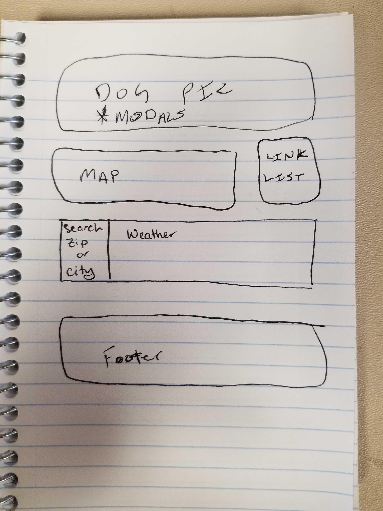
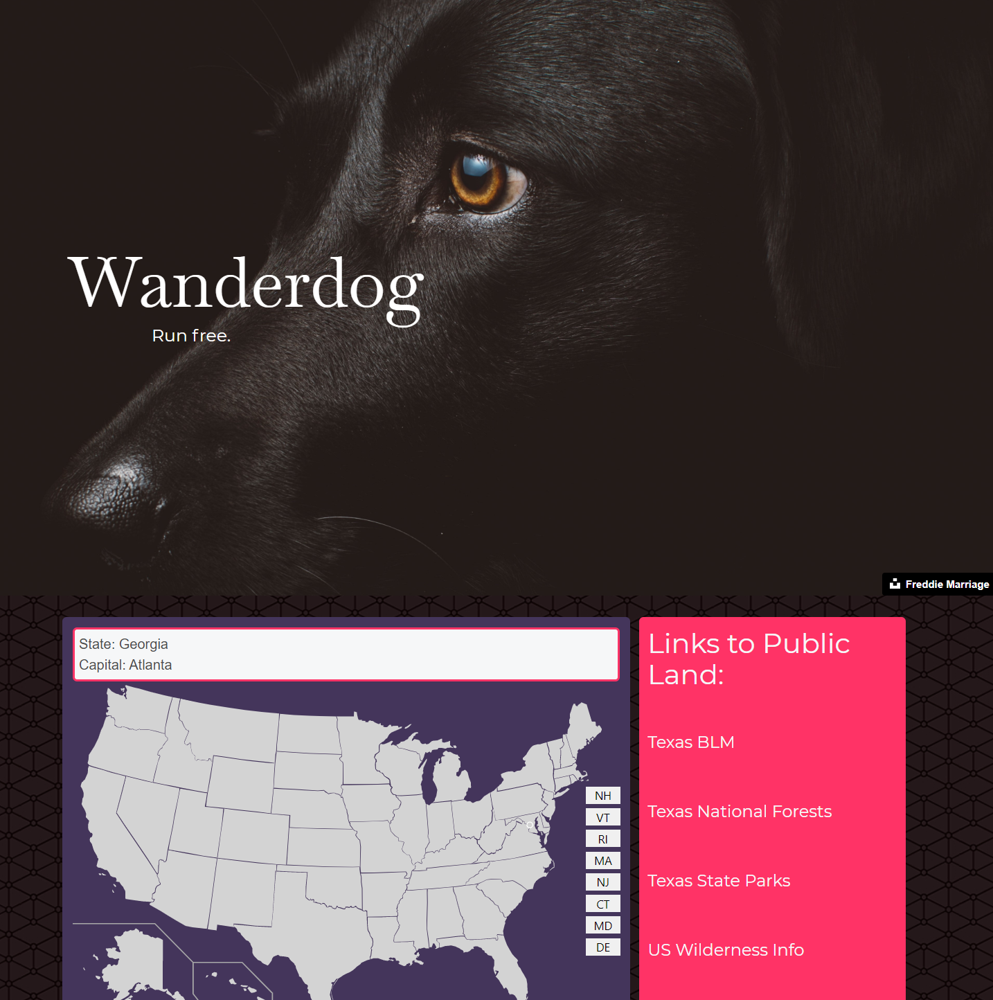
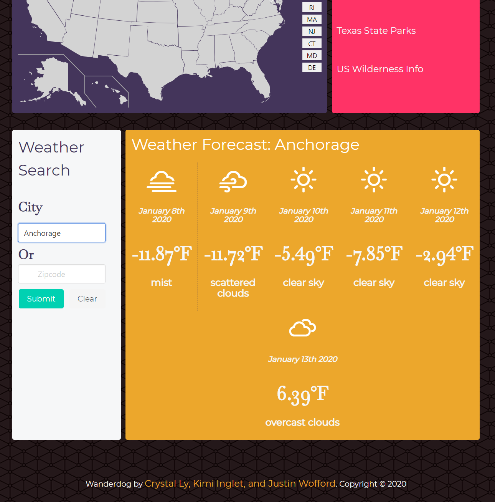

# Project meanLeanFreakGoat's Off Leash Location Finder, AKA Wanderdog!

This application draws from public information to obtain free trails, camp grounds, and parks for your 4-legged pooch! Also provides weather data for your location!

## Getting Started

* [Click Here!](https://kimiinglet.github.io/meanLeanFreakGoat/)

These instructions will help you locate the perfect spot to spend time with your pups.

As dog owners, we wanted to find areas in the US where we can camp/hike with our dogs off-leash, so that we can spend quality time with our dogs and allow them to explore nature.

## Wireframe

Please forgive our rough sketch. 
 

## How to use Wanderdog

Clicking on a state will return results for locations near you.

Input City OR Zip code for weather.

## How Wanderdog works
We used Recreation's API to return campsites where dogs are allowed. We also searched for state parks and forests where you can visit with your dog off-leash. 
Please keep in mind:
 * [Outdoor Ethics](https://lnt.org/) and to 
 * [Tread Lightly!](https://www.treadlightly.org/)

## Built With

* [Google Maps](https://www.google.com/maps) - We draw from Google's API to grab locations and map area.
* [Weather](https://openweathermap.org/) - We draw from Open Weather Map to grab current and future weather of the location you select.
* [Weather Icons](https://github.com/erikflowers/weather-icons/) - We used Erik Flowers' beautiful weather icons.
* [USA Data](https://www.data.gov/) - We used US Federal govt. open data to pull public land locations.
* [Bulma](https://bulma.io/documentation/) - We used Bulma CSS framework. 
* [Unsplash](https://unsplash.com/t/animals) - We used copyright-free images from this site.
* [FontAwesome](https://fontawesome.com/) - We used the dog icon.
* [Google Fonts](https://fonts.google.com/) - We used 1 font style from Google Fonts.
* [Moment](https://momentjs.com/) - We used Moment to grab current date and forecast dates.

## Contributing

Thanks to Crystal Ly, Kimi Inglet, and Justin Wofford for creating this!
Thanks to Isreal Medina, Brittany Taylor, and Eric Scott for teaching and guiding us through this bootcamp!

## Authors

* [Crystal Ly](https://github.com/cml2377)
* [Kimi Inglet](https://github.com/kimiinglet)
* [Justin Wofford](https://github.com/JayDub21)

## License

This project is licensed under the MIT License - see the [LICENSE.md](LICENSE.md) file for details

## Acknowledgments

* Hat tip to anyone whose code was used
* Thanks to our dogs, Orion, Nox, Koda, Kimber, and Piper. Thank you for being our best friends.
